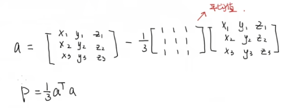
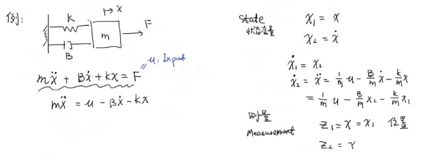
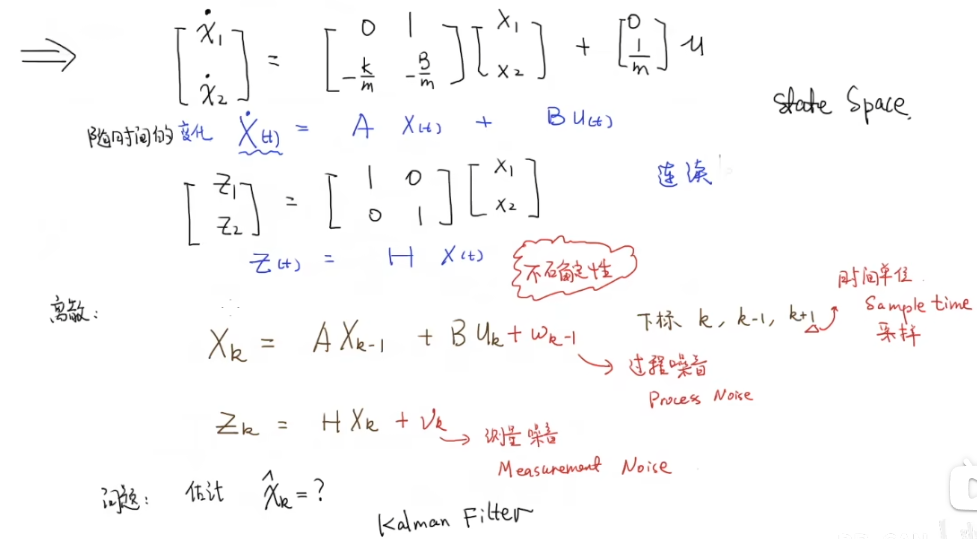

# 第二部分.数学基础 数据融合 协方差矩阵 状态空间方程 观测器

## 数据融合 data fusion

举个例子

用两个称，称一个东西，两个称都有误差，都服从高斯分布（正态分布）

使用卡尔曼滤波的思想融合两个称的数据，使融合后的数据方差更小

因为两个称，所以两个称的数据相互独立

## 协方差矩阵

举个例子

对球员的身高、体重、年龄分别计算平均数，方差，协方差

对于协方差

若两个两个值相差都是正的那乘起来也是正的，若两个值相差都是负的那乘起来也是正的

协方差为正说明两个变量变化方向相同，协方差为负说明两个变量变化方向相反 

比如身高变高，体重也相应增大，身高大于平均值，体重一般也大于平均值。

协方差矩阵就是把方差、协方差写成矩阵形式。这样可以很方便分析数据的关系了。

如何通过矩阵运算来计算协方差矩阵？这对编程很有帮助

先求过渡矩阵，再求协方差矩阵

## 状态空间表达 state space representation

举个例子

弹簧震动阻尼系统

阻尼器的力与速度成正比

物体的质量是m，向右施加的力是F，向右的位移是x，弹簧的劲度系数是k，B是阻尼系数 

设置状态变量，写出状态方程和测量方程

其实就是根据测量所得到的位移、速度，计算加速度

写成矩阵的形式

有不确定性可以增加模型噪音，测量噪音

离散的情况需要根据采样时间改变

测量方程为传感器测得数据，可以增加传感器噪音

状态方程根据上一时刻的状态和输入预测下一时刻的状态

如何在不确定的情况下预测，这是卡尔曼滤波所解决的问题

