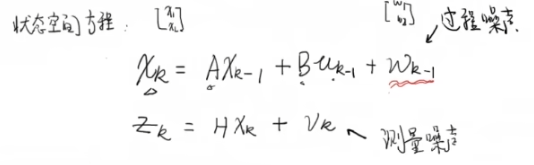

# 第三部分.卡尔曼增益数学推导

上一节课我们得出了状态空间方程

状态空间方程中存在噪声，这一部分是我们无法掌握的，但是一般都服从正态分布

我们可以写出噪声的协方差矩阵

怎么来的可以查找一下，方差公式和协方差公式

测量噪声也可以如此

但是我们无法掌握噪声，我们得出的只是一个估计值，因此加一个hat，我们仅仅根据模型推导出来不做任何处理，因此加一个负号，表示先验估计，上一次的状态值也是得不到的，得到的只有后验的估计值

测量值通过变换矩阵得到状态值，状态值为变换矩阵的逆称测量值

这样我们有了两个结果，一个是算出来的结果，一个是测出来的结果。但这两个结果都没有噪声的影响，这时候就要看卡尔曼滤波器了，用不准确的结果得到相对准确的结果

教科书喜欢做个变换

目标变成了寻找卡尔曼增益使得后验估计接近于真实值，卡尔曼增益与误差噪声息息相关

先引入误差 

寻找卡尔曼增益使得误差的协方差矩阵的迹最小，那么方差就最小了，误差也就最小了 

计算误差的协方差矩阵

协方差矩阵的迹，求导求极点得最小值

R是测量噪声的协方差矩阵、

R特别大，最优估计值偏向于先验估及

R特别小，最优估计偏向于测量值

